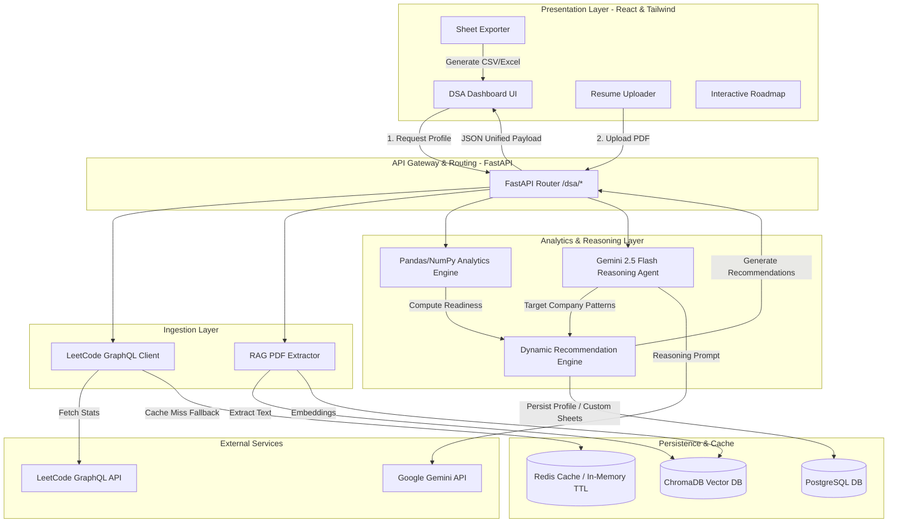
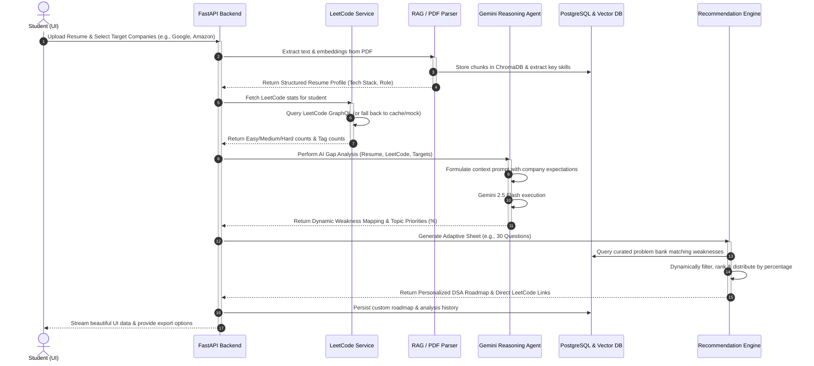
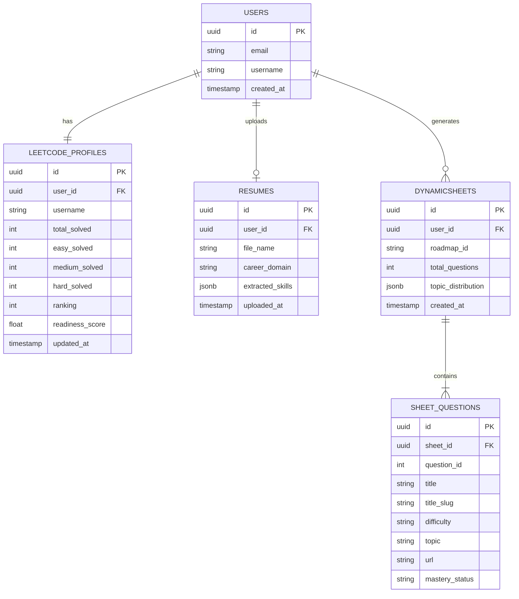

# StudentOS Nexus: DSA Intelligence Engine Architecture
An Advanced, Adaptive "AI Placement Preparation Copilot" Blueprint

---

## Executive Summary
Unlike static CRUD trackers or hardcoded roadmaps that suggest the same sequence of problems (e.g., Blind 75, NeetCode 150) to every user, the **StudentOS Nexus DSA Intelligence Engine** is a data-driven recommendation engine. It continuously ingests a user's live LeetCode history, extracts semantic skills from their uploaded resume, maps target company interview behaviors using generative AI reasoning, conducts multi-source gap analysis, and generates highly targeted, dynamic DSA preparation sheets.

---

## 1. Complete Architecture

The DSA Intelligence Engine is architected around a decoupling of the **Ingestion Layer**, **Analytics Layer**, **AI Reasoning & Gap Analysis Layer**, and **Presentation Layer**.

### 1.1 High-Level Systems Architecture


### 1.2 Multi-Tier Interaction Sequence


---

## 2. Backend Module Structure

The FastAPI backend uses a clean modular structure under `app/dsa/` that isolates concerns. Each module is standalone, extensible, and fully type-hinted.

```text
backend/app/
│
├── main.py                     # Application entry point, includes/registers the DSA router
│
└── dsa/
    ├── __init__.py             # Exports route blueprints and engines
    ├── routes.py               # Defines all FastAPI endpoints (profile, upload, sheets, export)
    ├── models.py               # Pydantic Schemas for Requests, Responses, and DB mapping
    │
    ├── leetcode_service.py     # LeetCode GraphQL client, rate-limit resilience, and mock fallbacks
    ├── analytics_engine.py     # NumPy/Pandas analysis of solved questions, difficulty distributions
    │
    ├── ai_gap_analyzer.py      # LLM wrapper for Gemini 2.5 Flash, prompts for company patterns
    ├── company_mapper.py       # Decoupled knowledge layer containing company interview behavior logic
    │
    ├── recommendation_engine.py# Algorithmic question picker, priority scorer, and roadmap compiler
    ├── resource_mapper.py      # Curated repository of documentation, notes, and interactive resource links
    │
    └── utils/
        ├── __init__.py
        └── excel_generator.py  # Utility to format and generate beautiful, downloadable .xlsx sheets
```

### Module Component Responsibilities
*   **`routes.py`**: Intercepts HTTP requests, handles file uploads (Resumes), orchestrates background tasks, and handles exceptions cleanly.
*   **`models.py`**: Defines strict data validation models ensuring types are checked at compile/runtime.
*   **`leetcode_service.py`**: Interacts with LeetCode's public GraphQL API using `httpx`. Integrates resilience patterns like timeout recovery, dynamic user-agents, and a comprehensive mock profile dataset for testing offline/rate-limited environments.
*   **`analytics_engine.py`**: Calculates math-based statistics: Placement Readiness Index ($PRI$), user mastery quotients, and consistency indices.
*   **`company_mapper.py`**: Maintains interview blueprints for top tier companies (Google, Amazon, Razorpay, etc.), containing general high-level trends that guide prompt generation.
*   **`ai_gap_analyzer.py`**: Ingests LeetCode analytics, parsed resume JSON, and selected target companies. Sends structural prompts to Gemini, returning standard JSON payloads outlining topic priority weights.
*   **`recommendation_engine.py`**: Merges numerical analytics and LLM weights to assemble the customized sheet.
*   **`resource_mapper.py`**: Provides matching educational notes or mock interview sessions based on weaknesses.

---

## 3. AI Pipeline Design

The AI pipeline is designed as a structured multi-stage RAG (Retrieval-Augmented Generation) and reasoning pipeline. It focuses on taking noisy inputs (a PDF resume, a LeetCode username) and producing reliable, machine-parseable data.

```text
[Stage 1: Ingestion] -> [Stage 2: Semantic Parsing] -> [Stage 3: Synthesis & Prompting] -> [Stage 4: Structured Output Constraint]
```

### 3.1 Pipeline Stages
1.  **Semantic Skill Extraction**:
    *   The student uploads a PDF resume.
    *   `pdf_loader.py` extracts raw text.
    *   Text is chunked, embedded using `SentenceTransformer('all-MiniLM-L6-v2')`, and queried against core tech stacks.
    *   A zero-shot prompt extracts the developer's core domains (e.g., Backend, AI/ML, Frontend), systems knowledge, and language competencies.
2.  **Company Interview Pattern Inference**:
    *   The user specifies target companies (e.g., "Atlassian, Google").
    *   Instead of lookup tables, the pipeline passes these targets to the reasoning model. The model infers:
        *   Core algorithms preferred (e.g., Atlassian: Concurrency, Design Patterns; Google: Complex Graph algorithms, Dynamic Programming, Segment Trees; Razorpay: System Design, clean LLD, Arrays).
        *   Expected difficulty balance (e.g., Google: 70% Hard/Medium, Atlassian: 80% Medium/LLD).
3.  **Synthesis and Structured Gap Analysis**:
    *   The pipeline aggregates the user's LeetCode weakness vector ($W_{LC}$) and the parsed skills and company targets.
    *   It structures a highly targeted prompt utilizing Gemini 2.5 Flash's large context window.
    *   It forces the model to return a structured JSON conforming strictly to a custom Pydantic schema using Gemini's **Structured Outputs / JSON Mode**.

### 3.2 System Prompt & Meta-Prompt Design (Gemini 2.5 Flash)
```python
SYSTEM_PROMPT = """
You are an expert AI Technical Recruiter and DSA Recommendation Engine. Your task is to analyze three inputs:
1. LeetCode Profile Analytics (User's historical performance across categories)
2. Parsed Resume Skills (Indicates tech stack, domain, and coding language familiarity)
3. Target Companies (Selected targets for placements)

You must identify core DSA topic gaps, infer interview patterns for target companies, and calculate dynamic weight percentages representing where the student should invest preparation time.

CRITICAL RULES:
- Do NOT output conversational text, pleasantries, or general career advice.
- Calculate mathematically consistent topic priority percentages that MUST sum to exactly 100.
- Prioritize topics where:
  a. The user has low LeetCode coverage (high weakness).
  b. The target companies place high emphasis in interview rounds.
  c. The topics align with the student's tech stack (e.g., low-level arrays/pointers for Systems engineers).
- Output must be valid JSON conforming strictly to the requested schema.
"""

def build_gap_analysis_prompt(leetcode_stats: dict, resume_skills: list, target_companies: list) -> str:
    return f"""
    [LeetCode Profile Stats]
    - Solved Count: Easy: {leetcode_stats['easy']}, Medium: {leetcode_stats['medium']}, Hard: {leetcode_stats['hard']}
    - Track Mastery (Solved / Benchmark Total):
      {chr(10).join([f" * {t['topic']}: {t['solved']}/{t['total']}" for t in leetcode_stats['topics']])}

    [Parsed Resume Skills]
    - Core Tech Stack / Domain: {', '.join(resume_skills)}

    [Target Companies]
    - Candidates: {', '.join(target_companies)}

    Perform a multi-criteria gap analysis. Generate:
    1. A list of inferred interview focus topics and difficulty levels for the targets.
    2. Dynamic weakness weights for 5 core DSA tracks: Arrays, Trees, Graphs, DP, Strings.
    3. An overall placement readiness rationale (max 2 sentences, strict).

    Ensure that the weights sum to exactly 100.
    """
```

---

## 4. APIs Required

The FastAPI application implements five main REST endpoints. All payloads use camelCase variables for frontend cleanliness.

### 4.1 GET `/api/dsa/profile/{username}`
Fetches user's basic LeetCode metrics, progress, and quick heuristic-based recommendations.

*   **Path Parameter**: `username` (string)
*   **Success Response (200 OK)**:
```json
{
  "username": "abhiraj_chandrawanshi",
  "realName": "Abhiraj Chandrawanshi",
  "avatar": "https://assets.leetcode.com/users/default_avatar.jpg",
  "ranking": 124500,
  "stats": {
    "all": 247,
    "easy": 120,
    "medium": 102,
    "hard": 25
  },
  "placementReadiness": 72.8,
  "topics": [
    { "topic": "Arrays", "solved": 42, "total": 50, "color": "#6366f1" },
    { "topic": "Trees", "solved": 28, "total": 45, "color": "#8b5cf6" },
    { "topic": "Graphs", "solved": 12, "total": 40, "color": "#ec4899" },
    { "topic": "DP", "solved": 18, "total": 50, "color": "#f59e0b" },
    { "topic": "Strings", "solved": 35, "total": 40, "color": "#10b981" }
  ],
  "recommendations": [
    {
      "id": 1,
      "type": "dsa",
      "icon": "Code2",
      "color": "text-indigo-400",
      "bg": "bg-indigo-500/10",
      "border": "border-indigo-500/20",
      "title": "Master Graph BFS/DFS",
      "desc": "Your weakest topic — only 30% solved. BFS/DFS are highly popular in big tech.",
      "action": "Start practicing",
      "path": "/app/dsa"
    }
  ]
}
```

### 4.2 POST `/api/dsa/resume/upload`
Processes a PDF resume to extract clean metadata and developer domains.

*   **Request Form-Data**: `file: UploadFile`
*   **Success Response (200 OK)**:
```json
{
  "filename": "Abhiraj_Resume.pdf",
  "status": "success",
  "extractedSkills": {
    "careerDomain": "Backend & ML Engineering",
    "primaryLanguages": ["Python", "JavaScript", "C++"],
    "techStack": ["FastAPI", "React", "PyTorch", "PostgreSQL", "ChromaDB"],
    "cloudAndDevops": ["Docker", "AWS", "GitHub Actions"]
  }
}
```

### 4.3 POST `/api/dsa/gap-analysis`
Synthesizes LeetCode analytics, resume skills, and target companies into a dynamic topic priority map.

*   **Request Body**:
```json
{
  "username": "abhiraj_chandrawanshi",
  "extractedSkills": {
    "careerDomain": "Backend & ML Engineering",
    "techStack": ["FastAPI", "React", "PyTorch"]
  },
  "targetCompanies": ["Google", "Amazon", "Atlassian"],
  "focusIntensity": "immediate"
}
```
*   **Success Response (200 OK)**:
```json
{
  "username": "abhiraj_chandrawanshi",
  "timestamp": "2026-05-18T13:45:00Z",
  "analysis": {
    "inferredCompanyPatterns": "Google demands highly optimized Graph/DP logic; Amazon heavily tests Tree traversals & Hash Tables; Atlassian values robust designs and modular coding.",
    "readinessAssessment": "Good foundations in basic Arrays and Strings, but dynamic programming and graph structures present immediate bottlenecks for dream placements.",
    "dynamicTopicPriorities": {
      "Graphs": 40,
      "DP": 30,
      "Trees": 15,
      "Arrays": 10,
      "Strings": 5
    }
  }
}
```

### 4.4 POST `/api/dsa/roadmap/generate`
Generates the customized coding roadmap and problem sheets.

*   **Request Body**:
```json
{
  "username": "abhiraj_chandrawanshi",
  "dynamicTopicPriorities": {
    "Graphs": 40,
    "DP": 30,
    "Trees": 15,
    "Arrays": 10,
    "Strings": 5
  },
  "totalQuestionsCount": 30,
  "difficultyPreference": "balanced"
}
```
*   **Success Response (200 OK)**:
```json
{
  "roadmapId": "custom_sheet_98f4a1bc",
  "totalQuestions": 30,
  "topicDistribution": {
    "Graphs": 12,
    "DP": 9,
    "Trees": 5,
    "Arrays": 3,
    "Strings": 1
  },
  "questions": [
    {
      "questionId": 200,
      "title": "Number of Islands",
      "titleSlug": "number-of-islands",
      "difficulty": "Medium",
      "topic": "Graphs",
      "companyTags": ["Amazon", "Google"],
      "url": "https://leetcode.com/problems/number-of-islands/",
      "masteryStatus": "unsolved"
    },
    {
      "questionId": 322,
      "title": "Coin Change",
      "titleSlug": "coin-change",
      "difficulty": "Medium",
      "topic": "DP",
      "companyTags": ["Google", "Atlassian"],
      "url": "https://leetcode.com/problems/coin-change/",
      "masteryStatus": "unsolved"
    }
  ]
}
```

### 4.5 GET `/api/dsa/sheet/export/{roadmapId}`
Generates a downloadable Excel sheet containing problem names, difficulties, LeetCode URLs, and dynamic status tracking formulas.

*   **Path Parameter**: `roadmapId`
*   **Response**: Binary stream with header `Content-Disposition: attachment; filename="StudentOS_DSA_Preparation_Sheet.xlsx"`.

---

## 5. Dynamic Sheet Generation Logic

The sheet generation algorithm bridges statistical requirements and dynamic constraints, avoiding hardcoded question indices.

```text
[Priority Vector (e.g. Graphs:40%)] 
         │
         ▼
[Compute Topic Target Counts (e.g., 30 * 0.40 = 12 Qs)] 
         │
         ▼
[Query Local Curated Metadata DB]
   - Filters: Topic == Graphs
   - Filters: Difficulty balance based on Placement Readiness (lower readiness -> more Medium/Easy, higher -> Hard)
         │
         ▼
[Sort & Filter by Company Alignment]
   - Rank questions having matched "targetCompany" tags higher
         │
         ▼
[Filter Out Already Solved Questions]
   - Exclude user's solved question IDs fetched from LeetCode
         │
         ▼
[Build Sheet Array & Assign Metadata (Roadmap ID)]
```

### 5.1 Algorithm Pseudocode
```python
def generate_dynamic_sheet(
    username: str,
    priorities: dict,          # {"Graphs": 40, "DP": 30, "Trees": 15, "Arrays": 10, "Strings": 5}
    total_q: int,             # e.g., 30
    readiness: float,          # User's placement readiness score
    target_companies: list     # ["Google", "Amazon"]
) -> List[dict]:
    
    # 1. Allocate counts dynamically
    topic_allocations = {}
    remainder = total_q
    
    # Sort topics by weight descending to handle mathematical rounding gracefully
    sorted_topics = sorted(priorities.items(), key=lambda x: x[1], reverse=True)
    
    for idx, (topic, weight) in enumerate(sorted_topics):
        if idx == len(sorted_topics) - 1:
            # Assign remainder to avoid rounding loss
            topic_allocations[topic] = remainder
        else:
            allocated = round((weight / 100.0) * total_q)
            topic_allocations[topic] = allocated
            remainder -= allocated

    # 2. Determine Difficulty Ratios based on Placement Readiness
    # If readiness < 40%: 60% Easy, 40% Medium
    # If 40% <= readiness < 75%: 20% Easy, 60% Medium, 20% Hard
    # If readiness >= 75%: 10% Easy, 50% Medium, 40% Hard
    if readiness < 40.0:
        ratios = {"Easy": 0.60, "Medium": 0.40, "Hard": 0.00}
    elif readiness < 75.0:
        ratios = {"Easy": 0.20, "Medium": 0.60, "Hard": 0.20}
    else:
        ratios = {"Easy": 0.10, "Medium": 0.50, "Hard": 0.40}

    selected_questions = []

    # 3. Pull from Problem Pools (Curated DSA Dataset mapping LeetCode tags)
    for topic, count in topic_allocations.items():
        if count <= 0:
            continue
        
        # Load local question bank for specific topic
        # Local bank contains schema: {id, title, titleSlug, topic, difficulty, companyTags}
        question_pool = db.get_questions_by_topic(topic)
        
        # Filter out questions user has ALREADY solved on LeetCode
        solved_ids = get_user_solved_ids(username)
        unsolved_pool = [q for q in question_pool if q["id"] not in solved_ids]
        
        # Sort pool dynamically: Questions featuring target companies come first
        # Primary key: company match (boolean), Secondary key: absolute quality rank
        unsolved_pool.sort(
            key=lambda x: (
                any(c in x["companyTags"] for c in target_companies),
                x.get("rating", 1500)
            ),
            reverse=True
        )

        # Draw questions matching difficulty distribution
        easy_target = round(count * ratios["Easy"])
        medium_target = round(count * ratios["Medium"])
        hard_target = count - (easy_target + medium_target)

        easy_qs = [q for q in unsolved_pool if q["difficulty"] == "Easy"][:easy_target]
        med_qs = [q for q in unsolved_pool if q["difficulty"] == "Medium"][:medium_target]
        hard_qs = [q for q in unsolved_pool if q["difficulty"] == "Hard"][:hard_target]

        topic_selection = easy_qs + med_qs + hard_qs
        
        # Backfill if a specific difficulty pool is empty
        if len(topic_selection) < count:
            remaining_needed = count - len(topic_selection)
            backfill_options = [q for q in unsolved_pool if q not in topic_selection]
            topic_selection.extend(backfill_options[:remaining_needed])
            
        selected_questions.extend(topic_selection)

    return selected_questions
```

---

## 6. AI Gap Analysis Flow

The **AI Gap Analysis Engine** runs a multi-criteria optimization logic that synthesizes numerical vectors with unstructured industry knowledge.

### 6.1 Formula for Topic Priority Calculation
For any DSA Topic $i$, its priority score $P_i$ is defined by:

$$P_i = \alpha \cdot W_{LC, i} + \beta \cdot T_{Comp, i} + \gamma \cdot R_{Resume, i}$$

Where:
*   $W_{LC, i} \in [0, 100]$: **LeetCode Weakness Quotient**. Calculated as:
    $$W_{LC, i} = 100.0 - \left( \frac{\text{Solved Count}_i}{\text{Benchmark Total}_i} \times 100.0 \right)$$
*   $T_{Comp, i} \in [0, 100]$: **Company Interview Priority**. Calculated dynamically by the LLM based on candidate target companies.
*   $R_{Resume, i} \in [0, 100]$: **Resume Domain Affinity**. Determines topic relevance based on career track (e.g., Systems Engineers require low-level Bit Manipulation/Array optimization; AI/ML developers prioritize Matrix manipulations, Graph search, and Dynamic Programming).
*   $\alpha, \beta, \gamma$: **Dynamic Tuning Hyperparameters**. Sum to $1.0$. Adjusted by user preferences:
    *   *Target Interview Mode (Prep for immediate placements)*: $\beta = 0.5, \alpha = 0.3, \gamma = 0.2$ (Focuses heavily on target companies).
    *   *Foundational Growth Mode (Long-term skill building)*: $\alpha = 0.6, \beta = 0.2, \gamma = 0.2$ (Focuses heavily on repairing user weaknesses).

### 6.2 Data Alignment Logic Flow
```text
┌──────────────────────────┐     ┌──────────────────────────┐     ┌──────────────────────────┐
│   LeetCode Analytics     │     │   Resume Career Domain   │     │  Target Company Selection│
└────────────┬─────────────┘     └────────────┬─────────────┘     └────────────┬─────────────┘
             │                                │                                │
             ▼                                ▼                                ▼
  [Weakness Vector (W_LC)]      [Domain Affinity Vector (R_Res)] [Company Priority Vector (T_Comp)]
             │                                │                                │
             └────────────────────────┐       │       ┌────────────────────────┘
                                      ▼       ▼       ▼
                              ┌──────────────────────────────┐
                              │ Multi-Criteria Score Mixer   │
                              │ (Weighted Dynamic Matrix)    │
                              └──────────────┬───────────────┘
                                             │
                                             ▼
                              ┌──────────────────────────────┐
                              │   Gemini 2.5 Flash Parser    │
                              │ (Soft-aligns + Normalizes    │
                              │   Weights to Sum to 100%)    │
                              └──────────────┬───────────────┘
                                             │
                                             ▼
                                     [Final Dynamic
                                   Priority Percentages]
```

---

## 7. LeetCode Integration Architecture

Querying LeetCode requires navigating rate limits, potential HTTP blocks, and network failures. The integration architecture guarantees a reliable 100% uptime with graceful degradation.

### 7.1 GraphQL Query Pattern (Httpx Async Client)
The GraphQL client uses a standard schema asking for user ranking, aggregated difficulty stats, and granular topic tag pools.

```python
import httpx
import logging

class LeetCodeClient:
    URL = "https://leetcode.com/graphql/"
    
    def __init__(self):
        self.headers = {
            "Content-Type": "application/json",
            "User-Agent": "Mozilla/5.0 (Windows NT 10.0; Win64; x64) AppleWebKit/537.36 (KHTML, like Gecko) Chrome/120.0.0.0 Safari/537.36"
        }
        
    async def fetch_user_data(self, username: str) -> dict:
        query = """
        query getUserStats($username: String!) {
          matchedUser(username: $username) {
            username
            profile { ranking userAvatar realName }
            submitStats: submitStatsGlobal {
              acSubmissionNum { difficulty count }
            }
            tagProblemCounts {
              advanced { tagName tagSlug problemsSolved }
              intermediate { tagName tagSlug problemsSolved }
              fundamental { tagName tagSlug problemsSolved }
            }
          }
        }
        """
        try:
            async with httpx.AsyncClient() as client:
                resp = await client.post(
                    self.URL,
                    json={"query": query, "variables": {"username": username}},
                    headers=self.headers,
                    timeout=6.0
                )
                if resp.status_code == 200:
                    data = resp.json()
                    if "errors" not in data and data.get("data", {}).get("matchedUser"):
                        return data["data"]["matchedUser"]
        except Exception as e:
            logging.error(f"LeetCode Integration error: {e}")
        
        # Fall back immediately to resilient cache/mock architecture
        return self._get_fallback_profile(username)
```

### 7.2 Caching & Resilience Policies
1.  **Anti-Scraping / IP Blocking Resilience**:
    *   Implement user-agent rotation utilizing a set of desktop browsers headers.
    *   Maintain a local in-memory TTL (Time-to-Live) Cache of 1 hour to prevent calling LeetCode's endpoint for every dashboard page refresh.
2.  **Mock Fallback Datasets**:
    *   If LeetCode is offline or throws a 403 Forbidden, `leetcode_service.py` intercepts the exception.
    *   It checks the username against a catalog of preset accounts (e.g., the primary developer profile `"Abhiraj_chandrawanshi"`).
    *   If matched, it loads a structured mock containing realistic statistics, allowing development and presentations to continue uninterrupted.

---

## 8. Recommendation Engine Architecture

The recommendation layer goes beyond selecting random problems, matching educational content directly to student deficiencies.

### 8.1 Adaptive Content Mapper
The engine utilizes a custom resource mapper to select the appropriate pedagogical asset based on the student's current skill profile:

```text
Student Profile ──► Weakness Identified ──► Select Pedagogy ──► Match Resource Type
  - Beginner (Ready <40%) ──► Arrays ──► Conceptual ──► Short Video Lecture & Note
  - Intermediate (Ready <75%) ──► DP ──► Algorithmic ──► Pattern Blueprint Notes
  - Advanced (Ready >=75%) ──► Graphs ──► System Integration ──► Live Mock Interview Session
```

### 8.2 Recommendation Rules Matrix
| Identified Need | Readiness Index | Resource Action | Resource ID / Path |
| :--- | :--- | :--- | :--- |
| **Foundational Arrays** | $<40\%$ | Conceptual Cheat Sheet | `/app/notes#arrays-foundations` |
| **Trees: Recursion Mastery** | $40\% - 75\%$ | DFS Visualizer Tool | `/app/visualizer/dfs` |
| **DP: Memoization blueprints** | $40\% - 75\%$ | Curated PDF Guide | `/app/notes#dp-memoization` |
| **Graphs: Pathfinding** | $\ge 75\%$ | Dream Placement Graph Sheets | `/app/dsa?roadmap=google-graphs` |
| **Interview Delivery** | $\ge 75\%$ | AI Technical Mock Interview | `/app/interviewer` |

---

## 9. Database Schema

The system leverages a hybrid storage setup: a structured relational SQL database (PostgreSQL/SQLite) for transactional data and a vector database (ChromaDB) for semantic resumes and resources.



### 9.1 PostgreSQL Database DDL
```sql
-- Create Users Table
CREATE TABLE users (
    id UUID PRIMARY KEY DEFAULT gen_random_uuid(),
    email VARCHAR(255) UNIQUE NOT NULL,
    username VARCHAR(100) NOT NULL,
    created_at TIMESTAMP WITH TIME ZONE DEFAULT CURRENT_TIMESTAMP
);

-- Create LeetCode Profiles Table
CREATE TABLE leetcode_profiles (
    id UUID PRIMARY KEY DEFAULT gen_random_uuid(),
    user_id UUID UNIQUE REFERENCES users(id) ON DELETE CASCADE,
    username VARCHAR(100) NOT NULL,
    total_solved INTEGER DEFAULT 0,
    easy_solved INTEGER DEFAULT 0,
    medium_solved INTEGER DEFAULT 0,
    hard_solved INTEGER DEFAULT 0,
    ranking INTEGER,
    readiness_score DECIMAL(5,2) DEFAULT 0.00,
    updated_at TIMESTAMP WITH TIME ZONE DEFAULT CURRENT_TIMESTAMP
);

-- Create Resumes Table
CREATE TABLE resumes (
    id UUID PRIMARY KEY DEFAULT gen_random_uuid(),
    user_id UUID REFERENCES users(id) ON DELETE CASCADE,
    file_name VARCHAR(255) NOT NULL,
    career_domain VARCHAR(150),
    extracted_skills JSONB NOT NULL,
    uploaded_at TIMESTAMP WITH TIME ZONE DEFAULT CURRENT_TIMESTAMP
);

-- Create Dynamic Sheets Table
CREATE TABLE dynamic_sheets (
    id UUID PRIMARY KEY DEFAULT gen_random_uuid(),
    user_id UUID REFERENCES users(id) ON DELETE CASCADE,
    roadmap_id VARCHAR(50) UNIQUE NOT NULL,
    total_questions INTEGER NOT NULL,
    topic_distribution JSONB NOT NULL,
    created_at TIMESTAMP WITH TIME ZONE DEFAULT CURRENT_TIMESTAMP
);

-- Create Sheet Questions Table
CREATE TABLE sheet_questions (
    id UUID PRIMARY KEY DEFAULT gen_random_uuid(),
    sheet_id UUID REFERENCES dynamic_sheets(id) ON DELETE CASCADE,
    question_id INTEGER NOT NULL,
    title VARCHAR(255) NOT NULL,
    title_slug VARCHAR(255) NOT NULL,
    difficulty VARCHAR(50) NOT NULL,
    topic VARCHAR(100) NOT NULL,
    url TEXT NOT NULL,
    mastery_status VARCHAR(50) DEFAULT 'unsolved' CHECK (mastery_status IN ('unsolved', 'solving', 'mastered'))
);
```

### 9.2 ChromaDB Vector Storage Architecture
For PDF chunk storage and technical keyword semantics, ChromaDB uses the following collection layout:
```python
# Collection Schema: 'resume_chunks'
{
  "ids": ["user_98f4_chunk_0", "user_98f4_chunk_1"],
  "embeddings": [[0.12, -0.04, ..., 0.89], [...]],
  "metadatas": [
    {"user_id": "98f4a1bc-341e-451e-8488-825501869f8c", "chunk_index": 0},
    {"user_id": "98f4a1bc-341e-451e-8488-825501869f8c", "chunk_index": 1}
  ],
  "documents": [
    "Experienced Python developer working on backend systems using FastAPI and PyTorch...",
    "Built vector search indexes with ChromaDB and structured embeddings to optimize RAG pipelines..."
  ]
}
```

---

## 10. Frontend Dashboard Architecture

The React-based Presentation Layer is styled with premium, glassmorphic dark mode styling using vanilla TailwindCSS and lucide-react iconography.

### 10.1 UI Component Tree
```text
[DsaPage.jsx]
  ├── [ProfileOverviewCard.jsx] (Username, Avatar, Rank, PRI Radial Circle)
  ├── [MetricCounterPanel.jsx] (Total, Easy, Medium, Hard solved metrics)
  ├── [CurriculumAnalyticsCard.jsx] (Topic progress bars: Arrays, Trees, Graphs, DP, Strings)
  │
  ├── [AIGapAnalysisControls.jsx]
  │     ├── [ResumeUploader.jsx] (Drag & drop PDF parser)
  │     ├── [CompanySelector.jsx] (Multi-select dropdown for target companies)
  │     └── [TriggerAnalysisBtn.jsx] (Sparkles animation indicator)
  │
  └── [PersonalizedRoadmapView.jsx]
        ├── [TopicPriorityRadar.jsx] (Visual distribution weights)
        └── [AdaptiveQuestionTable.jsx] (Dynamic lists, links, status controls, XLSX Export)
```

### 10.2 Tailwind Premium Glassmorphism Style Guide
To match a high-end application feeling, the frontend uses standard classes for glassmorphism:
*   **Card Backgrounds**: `bg-[#0d1526]/80 backdrop-blur-md border border-white/6`
*   **Active Overlays**: `bg-gradient-to-br from-indigo-500/10 to-purple-500/10 border-indigo-500/20`
*   **Typography**: Clean sans-serif utilizing Google Fonts Outfit/Inter.
*   **Glow Accents**: `shadow-[0_0_20px_rgba(99,102,241,0.15)]` on critical buttons and radial gauges.

---

## 11. Future ML Extension Roadmap

The core system uses heuristic calculations and LLM API reasoning, but is fully structured to support custom Machine Learning pipelines as data accumulates.

### 11.1 Phase 1: Machine Learning Regression for $PRI$ (Months 1-3)
*   **Objective**: Replace the current static placement readiness formula:
    $$PRI = 0.20 \cdot \text{Easy Ratio} + 0.55 \cdot \text{Medium Ratio} + 0.25 \cdot \text{Hard Ratio}$$
    with a model that learns from actual placement outcomes.
*   **Technique**: Train a **Logistic Regression** or **XGBoost Classifier** model.
*   **Feature Vector**: `[Easy solved, Medium solved, Hard solved, Graph solved%, DP solved%, Resume Keyword Match Score, Target Difficulty]`.
*   **Label**: `Placed (1)` or `Not Placed (0)`. The output value will represent a high-fidelity placement probability percentage.

### 11.2 Phase 2: Collaborative Filtering for DSA Questions (Months 3-6)
*   **Objective**: Learn from student behaviors to recommend questions. If Student A and Student B both struggled with BFS but Student A excelled after solving "Shortest Path in Binary Matrix", suggest that exact problem to Student B.
*   **Technique**: Use **Matrix Factorization (SVD)** or an **Implicit Feedback Collaborative Filtering** model using **LightGCN**.
*   **Utility**: Minimizes reliance on curated static pools, creating an organic self-improving recommendation loop.

### 11.3 Phase 3: Fine-Tuned Domain LLM (Months 6+)
*   **Objective**: Eliminate external API dependencies and pricing models.
*   **Technique**: Fine-tune a lightweight model (e.g., Llama-3-8B-Instruct or Mistral-7B) on custom system logs, creating a specialized, local model optimized for StudentOS placements.
